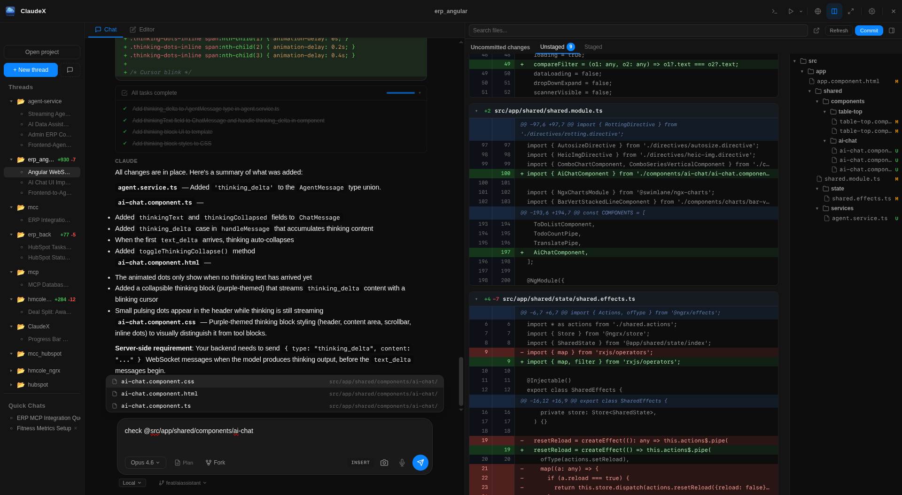
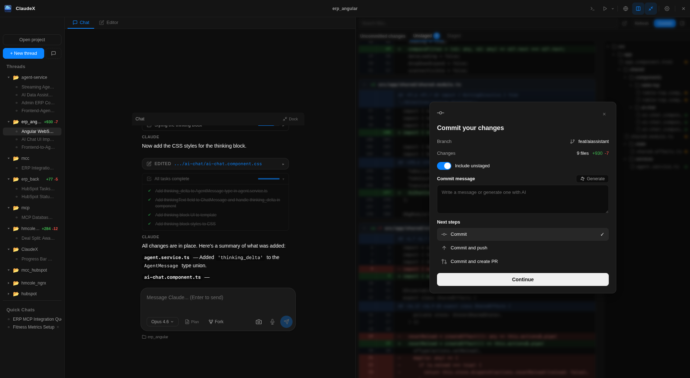
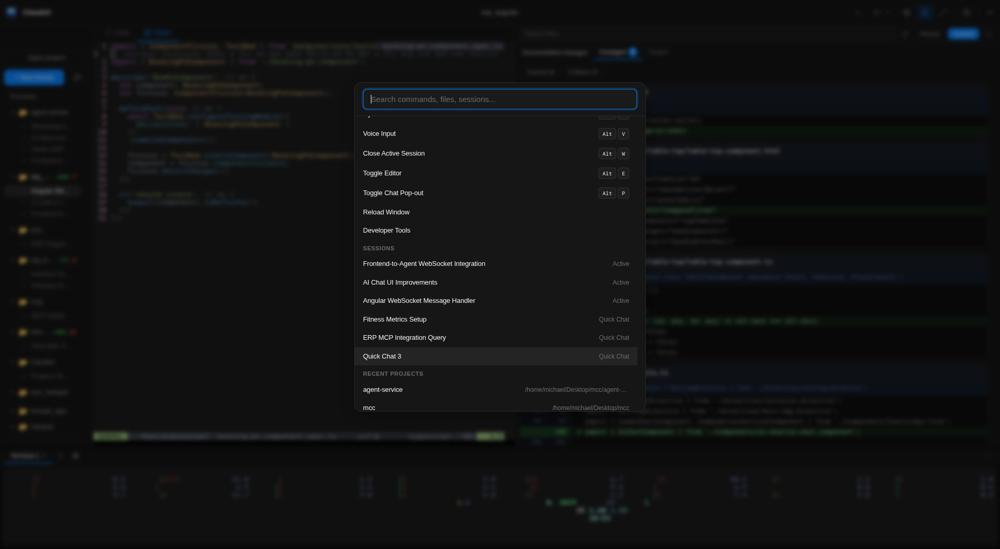

# ClaudeX

A desktop IDE for managing Claude Code agent sessions across multiple projects. Built with Electron, React, and TypeScript.

ClaudeX gives you a visual interface to run Claude Code agents with integrated terminals, an embedded browser, diff views, and session persistence — all in one window.

## Screenshots

Main Interface (chat + side panels + terminals):



Commit Dialog (diff-aware commit flow with AI message generation):



Command Palette (commands, files, sessions, projects, branches, themes):



## Full Feature Support

### Threads and Sessions
- **Multi-project workspace** — Open, switch, and reorder projects with per-project state memory
- **Quick Chat sessions** — Chat without opening a project (`__scratch__` mode)
- **Multiple concurrent Claude threads per project** with active/inactive/needs-input status
- **Session history** — Persist and resume past sessions (stored history capped at 200 entries)
- **Session persistence across restart** — Restores UI layout, theme, expanded projects, and serialized sessions
- **Inline session rename** and context menu actions (rename, close, fork, close others)
- **Session forking** — Fork into two parallel branches (Fork A / Fork B) with independent worktrees
- **Pop-out chat window** — Detach and re-dock chat

### Claude Agent Integration
- **Claude Agent SDK integration** with streaming partial output and typed event handling
- **Model selection per session** — `Opus 4.6`, `Sonnet 4.6`, `Haiku 4.5`
- **Cost + turns tracking** from SDK result metadata
- **Thinking blocks** (streaming and completed) with expandable rendering
- **Tool execution timeline** with grouped tool calls and compact read grouping
- **Tool permission controls** — Allow / Allow Always / Deny on pending tool calls
- **Plan review flow** for `ExitPlanMode` prompts (Approve, Reject, or Feedback)
- **Ask-user flow** for structured questions (single-select, multi-select, and free text)
- **Todo tool rendering** with pinned active todo state
- **Next message suggestions** — AI-generated follow-up predictions shown as ghost text in the input, accept with Tab
- **Key moments rail** — Scrollable sidebar showing conversation milestones (messages, tool uses, errors, questions) with click-to-jump navigation
- **Session preview cards** — Hover over sessions in the sidebar to see model, turn count, last messages, and streaming status
- **Queued outbound user messages** while an agent is busy
- **Retry last user prompt** action

### Project, Git, and Diff Tooling
- **Git status + diff views** for staged and unstaged changes (including untracked file diffs)
- **File tree diff browser** with directory expansion, filters, and status badges
- **Context actions from diff** — Add file reference to prompt, open in editor
- **Branch visibility and branch switching** in chat footer and command palette
- **Git helpers** — stage, commit, push, remotes, log, diff summary
- **Commit modal workflow**:
  - Include unstaged toggle
  - AI-generated commit message
  - Commit / Commit+Push / Commit+PR (via `gh pr create --web`)
- **Project start configuration** — save named startup commands, optional build command, optional browser URL
- **Run actions** — launch configured commands into integrated terminals

### Worktrees
- **Optional per-thread isolated worktree** on first prompt
- **Include local uncommitted changes** when creating worktree
- **Worktree action bar**:
  - open terminal in worktree
  - create branch
  - sync to local (`apply` or `overwrite`)
  - discard/remove worktree
- **Bidirectional sync APIs** (`sync-to-local`, `sync-from-local`) and worktree diff retrieval
- **Automatic cleanup/pruning** on app shutdown

### Integrated Terminal
- **Per-project PTY terminals** with multiple tabs
- **Terminal split view** (two shell panes with draggable divider)
- **Terminal popout** — Launch any terminal tab in an external emulator (kitty, alacritty, wezterm, etc.) with automatic detection, buffer history replay, and bidirectional I/O via Unix sockets
- **Inline tab rename**, add/remove tabs, active tab memory by project
- **Search inside terminal output** (`Ctrl+F`)
- **Copy/paste support** (context menu + `Ctrl+Shift+C/V` in terminal view)
- **Bracketed paste mode** for CLI safety/compat

### Editor and Browser Panels
- **Embedded Neovim editor tab** (per-project `nvim` process)
- **Open file in editor** from command palette and diff/project integrations
- **Auto buffer refresh after agent tool results** (`:checktime`) and `autoread` support
- **Embedded browser side panel** with:
  - per-project tab sets
  - URL navigation/back/forward/reload
  - tab create/switch/close
  - context menu actions
  - inspect element/devtools
  - page URL/content/screenshot bridge APIs

### MCP Support
- **Built-in ClaudeX bridge MCP server** with tools for:
  - terminal operations (execute, write, read output)
  - browser interactions (navigate, click, type, screenshot)
  - inter-session messaging for agent coordination
- **User-managed local MCP servers** — add/edit/remove/start/stop/enable
- **Remote MCP server management** — Enable/disable Claude-authenticated remote servers (e.g., HubSpot) per-session with disallowed tools filtering
- **Auto-start MCP servers** on launch
- **External MCP config discovery** from:
  - `~/.mcp.json`
  - project `.mcp.json` files found by walking ancestor directories
- **Claude-reported remote MCP visibility** (tools surfaced in settings UI)
- **Per-project MCP refresh** when project context changes

### Voice, Screenshots, and Notifications
- **Voice input button** with local Whisper transcription (`onnx-community/whisper-tiny.en`)
- **Screenshot-to-prompt** capture that inserts `@/path/to/image.png` references
- **Desktop notifications** when a session needs user input
- **Optional completion sound** and attention notifications
- **Prevent sleep toggle** while working

### Appearance and UX
- **18 built-in themes** with xterm theme synchronization:
  - `dark`, `light`, `monokai`, `solarized-dark`, `solarized-light`, `nord`,
  - `dracula`, `catppuccin-mocha`, `catppuccin-latte`, `tokyo-night`, `gruvbox-dark`, `one-dark`,
  - `rose-pine`, `everforest-dark`, `kanagawa`, `ayu-dark`, `github-dark`, `synthwave`
- **Customizable modifier key** for app shortcuts
- **Vim mode options**:
  - legacy input behavior toggle
  - Vim keybindings in chat textarea (`NORMAL/INSERT/VISUAL`)
- **Resizable layout panes** (sidebar, side panel, terminal height, terminal split ratio)
- **Command palette** with fuzzy search across commands/files/sessions/terminals/projects/branches/themes

## Installation

### Prerequisites

- [Claude Code CLI](https://docs.anthropic.com/en/docs/claude-code) installed and authenticated
- `git` available on `PATH` for git/diff/worktree features

### Optional dependencies (feature-specific)

- `nvim` for embedded editor support
- `scrot` for screenshot capture button
- `gh` for "Commit and create PR" flow

### Pre-built packages

Download the latest release from the [Releases](https://github.com/MMcintire96/ClaudeX/releases) page, then:

**AppImage (any Linux distro):**
```bash
chmod +x ClaudeX-*.AppImage
./ClaudeX-*.AppImage
```

**Deb (Debian/Ubuntu):**
```bash
sudo dpkg -i claudex_*_amd64.deb
```

**macOS:**
Open the `.dmg` and drag ClaudeX to Applications.

**Windows:**
Run the `.exe` installer.

### Build from source

Requires Node.js (v18+) and npm.

```bash
git clone https://github.com/MMcintire96/ClaudeX.git
cd ClaudeX
npm install
npm run package    # Outputs to dist/
```

### Development

```bash
npm run dev        # Start with hot reload
npm run build      # Build all bundles
npm run preview    # Preview production build
```

## Architecture

ClaudeX follows Electron's three-process model:

```
src/
├── main/           # Main process — app lifecycle, native APIs, agent/terminal management
│   ├── agent/      #   AgentManager → AgentProcess → Claude Agent SDK
│   ├── bridge/     #   ClaudexBridgeServer (MCP tool bridge)
│   ├── browser/    #   Embedded browser tabs
│   ├── terminal/   #   PTY terminal management
│   ├── worktree/   #   Git worktree lifecycle
│   ├── project/    #   Project & git operations
│   └── session/    #   State persistence & session history
├── preload/        # Preload bridge — exposes window.api via contextBridge
└── renderer/       # React UI — components, Zustand stores, hooks
    ├── components/
    │   ├── chat/       # Chat view, message rendering, tool blocks
    │   ├── layout/     # App shell, sidebar, panels
    │   ├── terminal/   # xterm.js terminal views
    │   ├── diff/       # Diff panel with diff2html
    │   └── settings/   # Settings panel
    └── stores/         # Zustand state (session, project, terminal, ui, settings)
```

### How agents work

1. `AgentManager` creates an `AgentProcess` which calls `query()` from `@anthropic-ai/claude-agent-sdk`
2. The SDK returns an async iterator of typed messages, mapped to `AgentEvent` types
3. Events flow to the renderer via IPC and are processed by `sessionStore`
4. Each agent gets an MCP config pointing to `ClaudexBridgeServer`, a localhost HTTP server that exposes terminal, browser, and session tools back to the agent
5. Paused agents (waiting for user input) can be resumed with `agent.send()` for tool approvals, question answers, and plan decisions

### Key technologies

- **Electron 40** — Desktop runtime
- **React 19** — UI framework
- **Zustand** — State management
- **@anthropic-ai/claude-agent-sdk** — Claude Code agent integration
- **xterm.js** — Terminal rendering
- **node-pty** — PTY creation
- **simple-git** — Git operations
- **electron-vite** — Build tooling

## Keyboard Shortcuts

| Shortcut | Action |
|---|---|
| `Mod+K` | Command palette |
| `Mod+?` | Show keyboard shortcuts |
| `Mod+N` | New session |
| `Mod+Shift+N` | New quick chat |
| `Mod+T` | New terminal |
| `Mod+O` | Open project |
| `Mod+B` | Toggle browser panel |
| `Mod+D` | Toggle diff panel |
| `Mod+S` | Toggle sidebar |
| `Mod+L` | Cycle color scheme |
| `Mod+V` | Voice input toggle |
| `Mod+P` | Popout chat |
| `Mod+W` | Close active session |
| `Mod+1-9` | Switch session by index |
| `Ctrl+\`` | Toggle terminal panel |

## License

MIT
